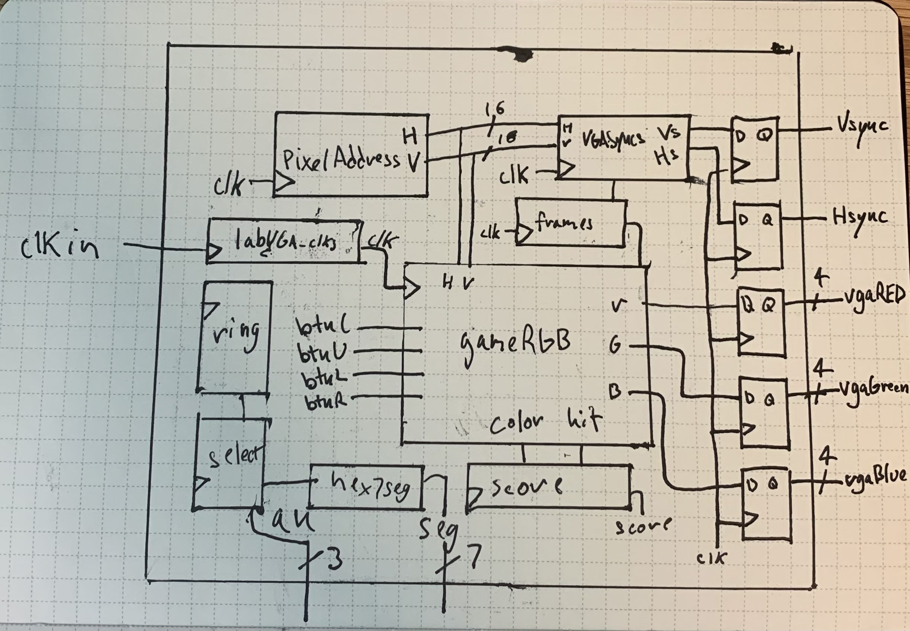
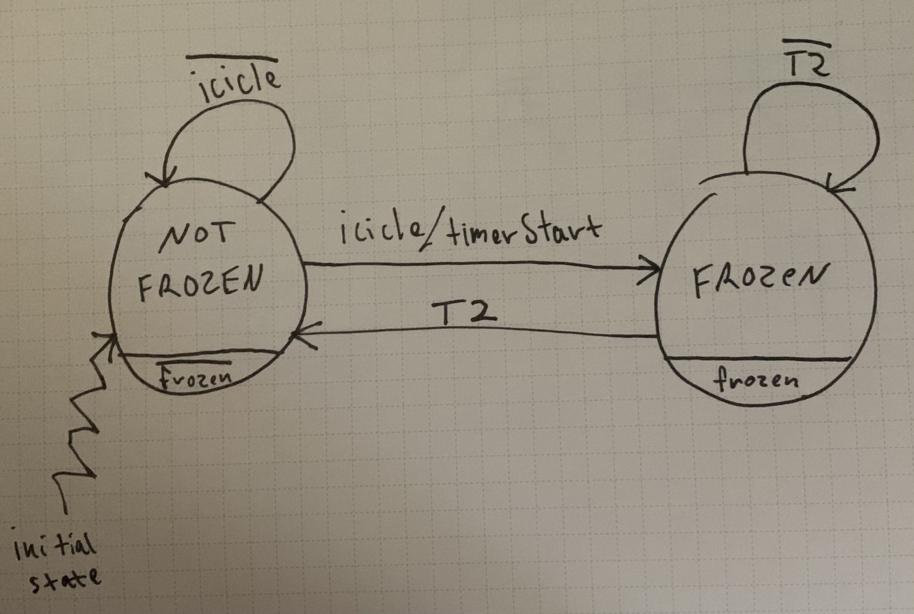
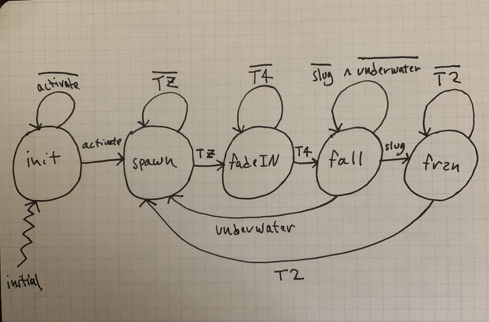

# Description

In this lab, students were asked to design 'Icicle Harvest', a simple
game in which a square slug flies around the screen and maneuvers around
different colored icicles falling from the ceiling for score. The slug
is controlled with left, right, and up buttons on the FPGA and the score
is displayed on the seven segment display on the board. When the game
first begins, the slug is at rest on a iceberg above a pool of water,
perched in the middle of the screen. It is free to move around the
screen, though if it lands in the water the slug sinks to the bottom and
the game is over. The game begins when the center button on the board is
pressed, and over a random amount of time different colored icicles
begin to fall from the ceiling. If the slug comes in contact with one of
these icicles, it freezes for a couple seconds before the icicle
disappears and begins to re-spawn. A point is either subtracted or
awarded from the slug depending on the randomly assigned color of the
icicle, with teal icicles awarding a point and magenta icicles
subtracting a point. The design of this game must be synchronous with
the clock on the Basys 3 FPGA, and similar to previous labs must only
use assign statements in Verilog. Dissimilar to the last labs, students
were allowed to use basic arithmetic operations in their design such as
addition, subtraction, and comparison operators. This lab was also the
first to utilize the VGA port provided on the board, and the game is
displayed on a full color RGB VGA monitor. This lab was the culmination
of all the skills gained from previous labs in the class, and the most
complex lab by far.

# Modules and Design

## Top Level Design

Despite the complexity of the lab, this was one of the lightest top
levels of any of the labs done previously. The top level design is
primarily responsible for first taking in the raw inputs on the board,
such as the buttons and switches, and providing them to the main logic
module, gameRGB. These inputs are not synchronized with the clock until
they are inside this module in order to reduce complexity of the top
level. The top level also contains the Pixel Address module, which is
used to address specific pixels on the screen to be colored before
displaying to the monitor, and is also fed to the main logic module.
VGASyncs is a module required by the VGA protocol, and its outputs are
fed through flip flops and output to the board. This is also true for
the 4 bit red, green, and blue color values that are output by the
gameRGB module. The last new module is the 'frames' module, which is
used by the game logic to do actions whenever a frame updates. Aside
from the new modules are the 16 bit counter to keep track of the game
score, and the anode display modules that are needed to display this
score on the 7 segment display on the board.

## Pixel Address and VGA Syncs

The pixel address and sync modules are new modules brought into the
program to adhere to the VGA's protocols. The pixel address is simply
implemented with two 16 bit counters, and correspond to the X and Y
positions of each pixel on the screen. Whenever the X counter reaches
the final horizontal pixel on the screen, the Y counter is incremented
and the X counter is reset. The VGA syncs module contains the horizontal
and verticle sync signals and are low in a specified pixel range on both
the X and Y axis. Otherwise, these syncs outputs are high.

## Game Logic Module/gameRGB

This module contains the main logic for the game which handles the
drawing of all objects, object collision, and contains the state machine
of the slug and its position. To start, the drawing of each object is
done with logical equations which tell the VGA on which pixels to color
the screen. These objects are also placed in the red, green, and blue
assign statements depending on the color they correspond to. Each
equation contains the current value of the pixel address, and when it
evaluates to true the object's corresponding color is drawn to the
screen. These equations also help us with object collision, such as with
the slug and the red border, since when these object are colliding both
of their assign statements will be true at the same time, which
simplified object collision immensely. The moving objects in the
program, the icicles and the slugs, need state machines in order to
apply logic to them correctly, which is kept in this module of the
program. While the icicles logic and state machine are kept in their own
module, the slug position is kept track of in this module with two
counters, slugY and slugX, which relate to the slugs vertical and
horizontal position respectively. For the left and right movement, the
clock enable is used to move the slug one pixel each frame, and NOT when
it is in collision with an object. This was relatively simple to
implement since the slug only moves one pixel in a direction each frame.
It became more complicated when implementing the counter for the slugs
vertical position since when the slug moves up it does so at a rate of 3
pixels per frame. This was implemented with the load functionality of
the counter, by simply loading in the current Y position of the slug
plus three whenever the up button was pressed. The final piece of logic
in this segment was the flashing logic, which is implemented with a
counter that resets every 16 frames. With this, we can keep track of
every quarter second and flash the slug and icicles when needed.

## Slug State

The slug state machine was interesting because as the program developed
further, the amount of states and their purpose for the slug simplified
more and more. Eventually two states were settled on for the slug:
unfrozen, and frozen. The state transition are dictated by the
collisions the slug has with an icicle, and a simple two second timer
that is in the gameRGB module. The slug is initially in the unfrozen
state, and is able to move freely around the screen. When the slug comes
into collision with an icicle, it transitions to the frozen state and
the timer is started. In the frozen state, the slug's position stays the
same and it is unable to move with the board buttons. When the timer is
up, the slug transitions back to the unfrozen state and is again able to
move freely. The collision of the slug and the icicle is handled within
one of the 10 icicle's modules in order for the program to know which
icicle the slug collided with and its corresponding color.

## Icicles

The icicles are implemented with 10 identical modules, which each
contain their respective icicle's state machine as well as its position
and timers. The icicles are by far the most complex module in the
program, and certainly take up the most text and space since there
needed to be 10 instances of icicles running simultaneously. The state
machine is designed as follows: the icicles begin in the 'init' state,
and is only in this state before the center button on the board is
pressed. After the center button is pressed and the module receives the
'activate' signal, it transitions to the spawn state. In the spawn
state, a random amount of time between 2 and 3.5 seconds as well as a
color (1 or 0) is chosen before the icicle begins to appear on the
screen in the next state. After the random amount of time is waited, the
icicle transitions to the next state and begins to fade in on the
screen. This is done over the course of four seconds, and implemented
using two timers. One timer is used to count out the number of frames
and increment the color value of the icicle from the value of zero to F.
The color value is incremented every 16 frames in order to achieve this.
After the four seconds have passed and the icicle is now displayed in
full color on the screen, the icicle begins to fall and the counter of
the icicle's y position is decremented every frame. This icicle falls
until it either comes in contact with the slug or it sinks into the
water. In the case the icicle never comes in contact with the slug, it
transitions back to the spawn state and chooses another random time to
appear on the screen. If it does come in contact with the slug, the
icicle transitions to the 'frozen' state where is stays in place on the
screen and flashes for two seconds before the score is incremented. When
the icicle comes into collision with the slug it sends out a signal to
gameRGB which tells it which icicle came in contact with the slug, which
is used to determine its color in the top module. This allows us to
increment of decrement the score depending on the color of the icicle.

The score was the last thing in the project that was implemented, and
one of the easiest. The main problem with the score was differentiating
when the slug collided with the two different color icicles. The
solution to this was handled party in the design of the icicle modules,
which output a high signal when in the frozen state (collided with a
slug). The signals from each one of these icicles was put into a 10 bit
bus that is output to the top module, iceHit. There is another 10 bit
bus arranged to correspond to each of the icicles colors, iceColors. A
new module was then created in the top level called 'chooseColor' that
takes in both of these buses, and simply outputs the corresponding value
in chooseColor whenever its associated icicle in iceHit is driven high.
After this was implemented, the rest of the logic for the score was
solved in previous labs. The iceHit bus reduced with the 'or' operator
is fed into an edge detector, and used as the CE for the score counter.
The output of chooseColor is used as the UD of the counter. Finally, the
value of this counter is put through a sign changer and then all modules
and logic corresponding to the value displayed on the 7 segment display
was reused from lab 5.

# Testing and Simulation

## Top Level Simulation

Unfortunately for this lab not much simulating could be used past
verifying the functionality of the VGASync modules as well as the RGB
modules. This is because the program runs at 60 frames per second, or
about 1 frame every 17ms. This means that simulating even one frame of
the program would take sometimes several minutes. Although there were
some solutions to this, more progress was made during this lab when a
bit stream was generated and uploaded and tested on the board. Despite
these challenges, a simulation was useful in testing that the components
needed for the VGA protocol were working properly before uploading them
onto the board, as well as isolating and testing some state machines.
The only state machine that a simulation was made for was the icicle
state machine, which was kept extremely simply and only used to ensure
that state transitions happened as expected.

## Testing on the Board

Since it proved difficult to test this lab while uploading it, most
testing was done on the board in order to see the visual output of the
program and get a better idea of what was happening with the program.
Another method that was used to debug the program was the led's on the
board, which were useful when trying to determine if state machines were
working correctly or if certain outputs were being correctly driven.

## Challenges

Several debugging challenges slowed progress in the assignment, and
since it was difficult to simulate the visual output of the program,
issues with the VGA and display were some of the biggest hurdles
encountered. One such hurdle was encountered after making some very
large additions to the program which included adding the movement of the
slug and refactoring some of the logic involved with drawing static
objects on the screen. Before making these changes, all static objects
such as the water, iceberg, and borders were correctly drawn to the
screen. After making the large additions and finally uploading to the
board to test, only a large flickering red square was displayed to the
screen and all objects previously displayed on the screen were gone.
This was confusing since the implementation had worked previously, so
somewhere in the new changes a bug had to be introduced. After losing a
lot of time poking around to the new changes, the code changed during
the refactoring was looked at and a reversed 'greater than' sign in a
boolean expression had caused the pixel addressee to display color
outside the allowed boundaries, which resulted in the junk appearing on
the screen.

Another difficult challenge that was presenting was when trying to get
an icicle to display on the screen. Again, most of the icicle's logic
and state machine was added at once without any testing, and when the
time came around to test it, it was not working as expected. The tricky
part was that when button C was pressed, simply nothing was happening on
the screen, leaving zero clues as to what the issue could possibly be.
The solution to this was mapping the different states of the icicle to
led's on the motherboard. This revealed that the icicles state machine
was getting stuck in its 'spawn' state, and then unexpectedly
transitioning back to its initial state. Several modifications to the
state machine were tried, and then implemented and uploaded to the
board, without any progress with this bug. It was not until a simulation
was made specifically for the state machine was made in when the real
issue was discovered. In the simulation, the value of every state past
the initial state and the 'spawn' were left uninitialized. After going
back to the state machine to try and figure out where this was coming
from, it was discovered that a syntax mistake was made in initializing
the CE field in the bus of flip flops that were initialized to zero.
Instead of this field being written as '41'b1', it was instead written
as '4'b1' meaning that only the first flip flop corresponding to the
'spawn' state was enabled. This simple mistake resulted in several hours
in debugging and a great lesson in testing as you implement.

# Results

After extensive debugging, testing, and uploading to the board dozens of
times, the final game works exactly as intended, and functions
identically to the game shown in class made by the professor. After
doing the timing report for the completed program, we ended up with the
worst negative slack to be 24.211 ns with the 25 Mhz clock frequency.
This means that the highest possible clock frequency that this program
could work with would be 63.335 Mhz. The timing report as well as
simulations for the syncs can be found in this write up appendix.

# Appendix {#appendix .unnumbered}

 

{#fig:enter-label
width="100%"}

 

{#fig:enter-label
width="100%"}

{#fig:enter-label
width="100%"}

 

 

 

 

 

 

 

 

 

 

 

 

 

 

 

 

 

 

 

 

 

 

 

 

 
